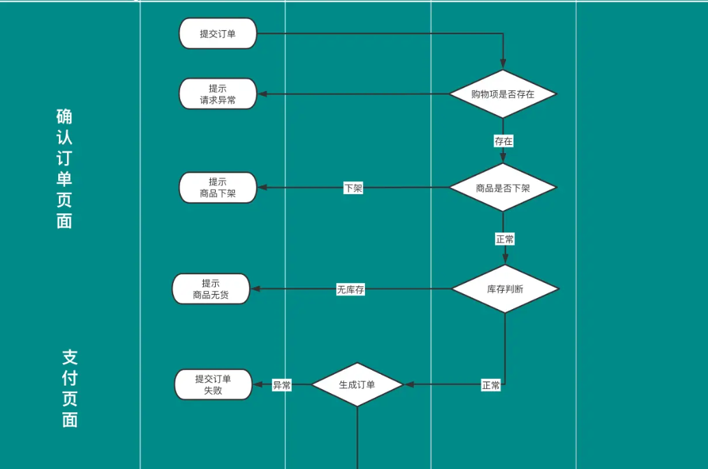
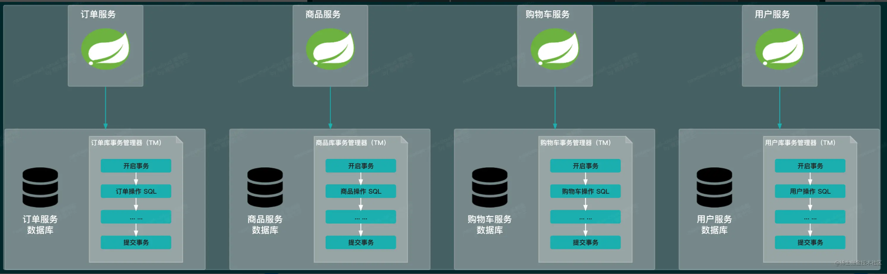
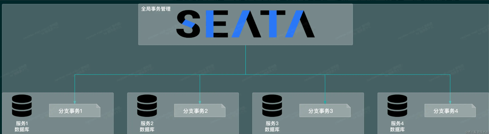
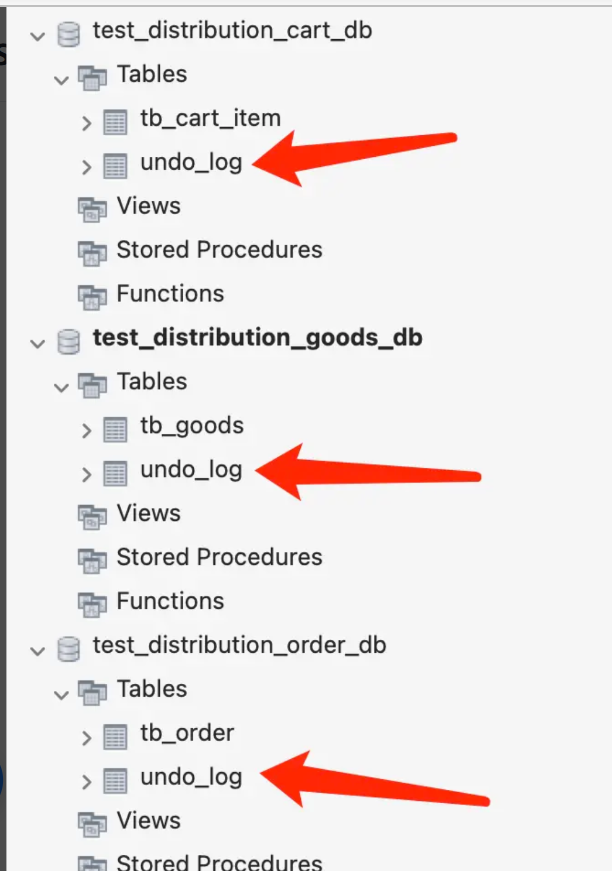

--- English ---

# erato-cloud-mall-newbee

## Technology Stack

- seata-server 1.4.2  
- nacos-server 2.0.2  

## Distributed Transaction Problem Demonstration



The detailed process of order creation is as follows:

- First, check whether the order contains any discontinued products. If yes, throw an exception; if not, continue the process.  
- Next, validate product data and stock. If the data is invalid or stock is insufficient, throw an exception; otherwise, continue.  
- Perform null checks on objects.  
- After generating the order, shopping cart items must be deleted by calling `ShoppingCartItemMapper.deleteBatch()` to remove them in batch.  
- Update product inventory records.  
- Validate order price: if the total of all cart items is 0 or less, do not proceed with order creation.  
- Generate an order number, encapsulate a `MallOrder` object, and save the order record to the database.  
- Encapsulate order item data and save it to the database.  
- Generate an order shipping address snapshot and save it to the database.  
- Return the order number.  

**Simplified method code:**

```java
public class MallOrderServiceImpl {

    @Transactional
    public Boolean saveOrder(int cartId) {
        // Call shopping cart service - get goods_id to be operated on
        int goodsId = newBeeShopCartDemoService.getGoodsId(cartId);
        // Call product service - decrease stock
        Boolean goodsResult = newBeeGoodsDemoService.deStock(goodsId);
        // Call shopping cart service - delete current cart data
        Boolean cartResult = newBeeShopCartDemoService.deleteItem(cartId);
        // Execute order creation logic
        if (goodsResult && cartResult) {
            // Insert a record into the order table
            int orderResult = jdbcTemplate.update("insert into tb_order(`cart_id`) value (\"" + cartId + "\")");
            // Exception example
            //int i=1/0;
            if (orderResult > 0) {
                return true;
            }
            return false;
        }
        return false;
    }
}
```

The method involves operations on the order table, order item table, shopping cart table, product table, user information table, and user address table. If any step fails validation or an exception is thrown at any point, all operations across these tables will be rolled back. This is the nature of database transactions: either fully executed or not executed at all.

In a microservices context, these tables are not located in the same database and do not share a unified transaction manager. What happens then?



## Seata Concept

In cross-database, cross-partition, or cross-service scenarios, ensuring that all SQL operations in a method either succeed or fail together becomes complex.

Distributed transaction problems have long existed, and the industry has proposed many solutions: Two-Phase Commit (2PC), Three-Phase Commit (3PC), TCC, and eventual consistency. These are theoretical approaches — top-level designs. To apply them in real projects, actual software implementations are required. In the Java open-source ecosystem, notable distributed transaction solutions include Sharding JDBC, Atomikos, MyCat, and Alibaba Seata.

These solutions, whether based on long transactions or message notification, abstract cross-database transactions into a new transaction concept. Without a distributed transaction solution, cross-database consistency cannot be achieved because each database has its own independent transaction manager. Distributed transaction frameworks introduce a new third-party coordinator to manage and abstract the process. At this point, a coordinator manages multiple database transactions, as shown below:



Seata acts as this third-party “coordinator” for cross-database transactions. It transforms cross-database and cross-service scenarios into a global transaction with multiple branch transactions.

- Only when all branch transactions succeed does the global transaction succeed (Commit).  
- If any branch transaction fails, all branch transactions are rolled back (Rollback).  

## Database and Table Preparation

To integrate Seata for solving distributed transaction problems, an `undo_log` table must be created in each microservice’s database. For example, if there are three microservices, each database (product, shopping cart, and order) must contain an `undo_log` table. The official Seata repository provides the schema:  

https://github.com/seata/seata/tree/develop/script/client

This directory includes scripts for AT, TCC, and SAGA modes. Since this project uses the AT mode (recommended for its simplicity and low business intrusion), the required schema is here:  

https://github.com/seata/seata/blob/develop/script/client/at/db/mysql.sql  

The final SQL schema is included in `/sql/undo_log.sql`.  

The `undo_log` table stores global transaction IDs, branch transaction IDs, rollback data, execution states, etc. If the global transaction fails, Seata uses this table to roll back each branch transaction. Therefore, the table must exist in every microservice’s database. For example, in this demo, it should be created in `test_distribution_cart_db`, `test_distribution_goods_db`, and `test_distribution_order_db`. After creation, the table looks like this:  



Next, add Seata-related configuration items. Official configuration files can be found here:  

https://github.com/seata/seata/tree/develop/script/client/spring  

Both `.properties` and `.yml` examples are available; choose based on your project. The main configuration items include:  

- `seata.enabled`: Enable automatic configuration  
- `seata.application-id`: Current Seata client application name  
- `seata.tx-service-group`: Transaction group  
- `seata.registry.type`: Service registry type (Nacos in this course)  
- `seata.registry.nacos.*`: Nacos-related configuration  

In newer versions, Seata can automatically proxy data sources. Seata creates a Druid data source and registers it with Spring’s IOC container, then uses it to generate a `DataSourceProxy` object, also registered with the IOC container.

--- 中文 ---

# erato-cloud-mall-newbee

## 技术选型

seata-server1.4.2

nacos-server2.0.2

## 分布式事务问题演示


订单生成的详细过程如下：

- 首先是检查是否包含已下架商品，如果有则抛出一个异常，无下架商品则继续后续流程
- 继续判断商品数据和商品库存，如果商品数据有误或者商品库存不足也会抛出异常，一切正常则继续后续流程
- 对象的非空判断
- 生成订单后，购物项数据需要删除，这里调用 ShoppingCartItemMapper.deleteBatch() 方法将这些数据批量删除
- 更新商品库存记录
- 判断订单价格，如果所有购物项加起来的数据为 0 或者小于 0 则不继续生成订单
- 生成订单号并封装 MallOrder 对象，保存订单记录到数据库中
- 封装订单项数据并保存订单项数据到数据库中
- 生成订单收货地址快照，并保存至数据库
- 返回订单号

简化后的方法代码:

```java
public class MallOrderServiceImpl {

    @Transactional
    public Boolean saveOrder(int cartId) {
        // 调用购物车服务-获取即将操作的goods_id
        int goodsId = newBeeShopCartDemoService.getGoodsId(cartId);
        // 调用商品服务-减库存
        Boolean goodsResult = newBeeGoodsDemoService.deStock(goodsId);
        // 调用购物车服务-删除当前购物车数据
        Boolean cartResult = newBeeShopCartDemoService.deleteItem(cartId);
        // 执行下单逻辑
        if (goodsResult && cartResult) {
            // 向订单表中新增一条记录
            int orderResult = jdbcTemplate.update("insert into tb_order(`cart_id`) value (\"" + cartId + "\")");
            // 此处出现了异常
            //int i=1/0;
            if (orderResult > 0) {
                return true;
            }
            return false;
        }
        return false;
    }
}
```

该方法涉及到的表有订单表、订单项表、购物项表、商品表、用户信息表、用户收货地址表。只要其中任何一个步骤没有通过验证或者在任意一行代码中抛出异常，那么涉及到这些表的操作都会回滚。这就是数据库事务的特点，要么完全地执行，要么完全地不执行。

微服务场景下，这些表不在一个数据库中，没有统一的事务管理器，会发生什么呢？


  

## Seata 思想

在跨数据库、跨分区、跨服务情况下，如果要保证一个方法中的 SQL 操作全部成功或者全部失败，则有些复杂。

当然，分布式事务这种问题存在已久，所以业内也有很多分布式事务的应对方案，比如常见的二阶段提交（2PC）、三阶段提交（3PC）、TCC方案和最终一致性方案。由于篇幅限制，这里就不进行拓展了，读者可以自行搜索上述这些关键词来学习。这些方案都是实现原理，算是一种顶层设计，如果要实际的应用到项目中，则需要使用这些方案所对应的实际软件产品。在 Java 开源领域能够提供分布式事务解决方案的软件中，比较有代表性的有 Sharding JDBC、Atomikos、MyCat、Alibaba Seata 等等。

在这些落地方案中，不管是基于长事务的方案还是基于消息通知的方案，都是对跨数据库事务的进一步抽象，形成一个新的事务概念。未加入分布式事务方案时，跨数据库的事务一致性是无法解决的，因为每个数据库都是独立的，其中的事务管理器也是独立的，互不干涉、互不影响。而上述的这些分布式事务解决方案，则是在数据库之外引入了一个新的角色，对整个流程进行进一步的抽象，在其中加入了一个协调者（或者说管理者），此时就存在一个第三方的管理者来协调多个数据库事务，如下图所示。


Seata 就是一个跨数据库事务的第三方“管理者”，它把跨数据库、跨服务的分布式事务场景变成了一个拥有多个分支事务的全局事务。

只有所有的分支事务都成功了，全局事务才算成功（Commit）。只要有一个分支事务失败了，则全部分支事务失败，所有的分支事务全部都会回滚（Rollback）。

## 建库建表准备

如果想要整合Seata来解决分布式问题，还需要在每个微服务实例所依赖的数据库中创建一张名称为undo_log的表。比如本库三个微服务实例，需要在商品服务的数据库、购物车服务的数据库和订单服务的数据库中各自新建一张 undo_log 表。具体的建表语句 Seata 官方已经提供了，地址如下：

https://github.com/seata/seata/tree/develop/script/client

在该目录下有多个文件夹，分别是 at/db、saga/db、tcc/db。因为 Seata 为开发者们提供了多种分布式事务的处理方式，比如 AT、TCC、SAGA，在选择不同的处理方案时，就需要引入不同的建表语句。

本库的编码中使用的 Seata 方案是 AT 模式。AT 模式是 Seata 官方比较推荐的一套分布式事务解决方案，因为这种方式比较简单、对业务侵入低、不需要改动具体的业务代码，添加一个注解再添加几行配置项即可整合 Seata 来解决分布式事务，非常方便。所以，需要引入的 undo_log 表的文件地址如下：

https://github.com/seata/seata/blob/develop/script/client/at/db/mysql.sql

最终的建表SQL内容见 `/sql/undo_log.sql`

通过 undo_log 表的建表字段可知，该表会存储全局事务和分支事务的id信息、回滚数据、执行状态等等信息，如果全局事务失败，就需要依次回滚所有分支事务，需要执行的内容就保存在这个表里。所以，undo_log 这个表需要创建在各个微服务实例下的数据库中。比如本demo，就要在 test_distribution_cart_db 数据库、test_distribution_goods_db 数据库和 test_distribution_order_db 数据库中依次创建这个表，建表成功后如下图所示。


然后添加与Seata相关的配置项。官方提供的配置文件可供参考，地址如下：

https://github.com/seata/seata/tree/develop/script/client/spring

这里有.properties和.yml两个格式的配置文件，根据自身项目配置文件的格式选择即可。主要增加的配置项如下：

- seata.enabled：是否开启自动配置
- seata.application-id：当前Seata客户端的应用名称
- seata.tx-service-group：事务分组
- seata.registry.type：服务中心的类型（本课程选择的是Nacos）
- seata.registry.nacos.*：与Nacos相关的配置信息


新版本 Seata 已可以自动代理数据源对象。Seata 会创建 Druid 数据源并注册到 Spring 的 IOC 容器中，然后使用它来生成 DataSourceProxy 对象并注册到Spring的IOC容器中
